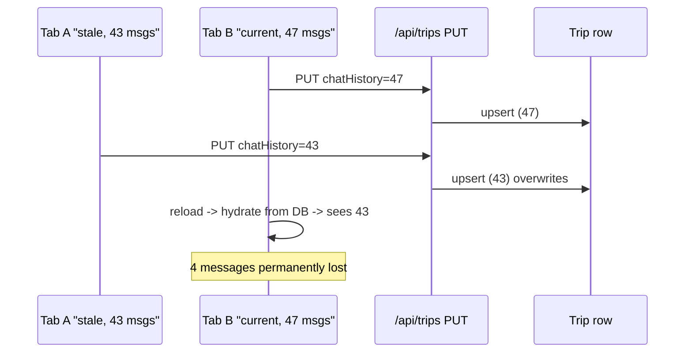

## Fix chat-save race that lost messages

### Recovery for the already-lost messages

There is no recovery — every tab and reload now returns the truncated `chatHistory` from the DB. The plan markdown the user wrote is unaffected. Recommended one-time action by the user: close all but one tab of the trip; reload once; from now on the fixes below prevent further loss.

### Root cause (one-liner)

`PUT /api/trips` is a blind upsert. Any tab can overwrite the saved `chatHistory` with its own (possibly shorter) in-memory snapshot, and the periodic 250 ms save in [src/components/chat-panel.tsx](src/components/chat-panel.tsx) fires on every mount/HMR, so two tabs ping-pong until the loser wins.



### 1. Server: monotonic guard with conflict response

[src/lib/trips-store.ts](src/lib/trips-store.ts) currently does an unconditional upsert at L96-L100:

```81:101:src/lib/trips-store.ts
export async function saveTrip(trip: Trip, userId: string): Promise<void> {
  const data = {
    ...
  };
  await prisma.trip.upsert({
    where: { id: trip.id },
    update: data,
    create: { id: trip.id, userId, ...data },
  });
}
```

Replace `saveTrip` with a transactional compare-then-save:

- Read existing `chatHistory` length and `updatedAt` for `(id, userId)`.
- If existing exists AND incoming `chatHistory.length < existing.chatHistory.length`, throw a typed `StaleSaveError` carrying the server-authoritative trip.
- Otherwise, upsert.
- Accept an optional `{ force?: boolean }` to bypass the guard (used by import / explicit "fix it from this tab" actions later — not wired now).

[src/app/api/trips/route.ts](src/app/api/trips/route.ts) PUT handler:

- Catch `StaleSaveError` and return `409` with `{ error: "stale", trip: <server version> }`.
- Log a `[chat-persist] put rejected stale` line so this race is visible in dev.

Apply the identical pattern to [src/lib/conversations-store.ts](src/lib/conversations-store.ts) and [src/app/api/conversations/route.ts](src/app/api/conversations/route.ts), using the `messages` field instead of `chatHistory`.

### 2. Client: handle 409 by adopting the server's state

In [src/components/chat-panel.tsx](src/components/chat-panel.tsx) `saveChat` at L216-L240:

- On `res.status === 409`, parse `{ trip }`, then:
  - Call `setMessages(server.chatHistory.map(...))` to replace local state with the authoritative version.
  - Update `useTripStore` (trip meta, phase) to match server.
  - Surface a transient toast/banner: "Another tab updated this chat; your view has been refreshed."
- Do not retry the failed save; the local state is now equal to the server, so the next user action will save naturally.

Mirror the same handling in [src/components/conversation-panel.tsx](src/components/conversation-panel.tsx) `saveConversation` at L91-L110.

### 3. Client: idempotency guard so mount/HMR doesn't save

Today the persist effect at L244-L259 of [src/components/chat-panel.tsx](src/components/chat-panel.tsx) schedules a save 250 ms after status becomes `ready` even when nothing changed. That's how a stale tab triggers a stale save.

Add a `lastSavedSignatureRef`:

```ts
const lastSavedSignatureRef = useRef<string | null>(null);

const signatureOf = (msgs: UIMessage[]) =>
  msgs.length === 0 ? "0" : `${msgs.length}:${msgs[msgs.length - 1].id}`;
```

On hydrate (existing effect at L148-L164), set `lastSavedSignatureRef.current = signatureOf(hydratedMessages)` so a freshly opened tab knows "this is what's on the server".

In `saveChat`, compute the current signature and bail if it equals `lastSavedSignatureRef.current`. After a successful save, update the ref. After adopting a 409 response, also update it.

Same change in [src/components/conversation-panel.tsx](src/components/conversation-panel.tsx).

This alone removes the "ping-pong on mount" amplifier; combined with the server guard, the worst case becomes "two tabs both legitimately edit and the older one gets a 409, refreshes, no data loss."

### 4. Cross-tab live sync via BroadcastChannel

Add a tiny hook `useTripChannel(tripId)` (new file [src/lib/use-trip-channel.ts](src/lib/use-trip-channel.ts)):

- Opens `new BroadcastChannel('trip-' + tripId)` on mount.
- Exposes `broadcastSaved(chatHistory, updatedAt)` and an `onRemoteSaved` callback.
- Closes on unmount; safe-guards `typeof BroadcastChannel !== "undefined"` for SSR.

Wire it in [src/components/chat-panel.tsx](src/components/chat-panel.tsx):

- After a successful `saveChat`, call `broadcastSaved(currentMessages, payload.updatedAt)`.
- In `onRemoteSaved`: if the incoming history is longer than local (or has a different last id with same/greater length), call `setMessages(remote)` and update `lastSavedSignatureRef`. Show a subtle "Synced from another tab" toast for 2 s.

Same for [src/components/conversation-panel.tsx](src/components/conversation-panel.tsx), keyed by `'conversation-' + conversationId`.

This eliminates the race even before the server fires a 409.

### 5. Tighten the `beforeunload` save

Currently [src/components/chat-panel.tsx](src/components/chat-panel.tsx) L261-L284 fires a `keepalive` PUT on every tab close, including tabs that did nothing. Gate it on `signatureOf(messagesRef.current) !== lastSavedSignatureRef.current`. Same in conversation panel.

### Verification checklist

- Open the same trip in two tabs, type in tab A, close tab B without typing -> server `chatHistory` unchanged in length, no 409s.
- Open in two tabs, send in tab A, then send in tab B before tab B has heard the broadcast: tab B receives a 409, adopts server state (now containing tab A's message), and the user's tab-B input is preserved in the input box (i.e. don't clear input on 409 — already true because we only clear after `sendMessage` success in `handleSubmit`, not on a separate save).
- HMR while idle: no PUTs (signature unchanged).
- Single-tab streaming: works exactly as before; save fires once when streaming -> ready.

### Out of scope

- Switching to append-only message writes (server merges by message id) — bigger refactor; the monotonic guard covers the realistic loss vector.
- Server-push (SSE/WebSocket) for multi-device sync.
- Adding `force` UI for the "I am authoritative, overwrite please" case.
